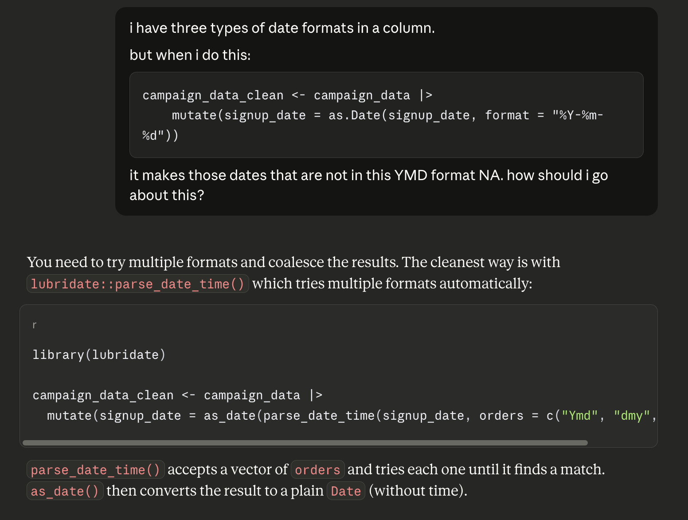
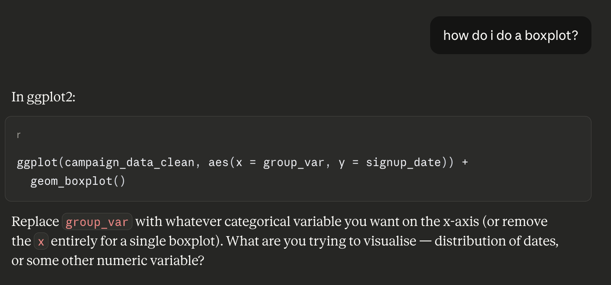
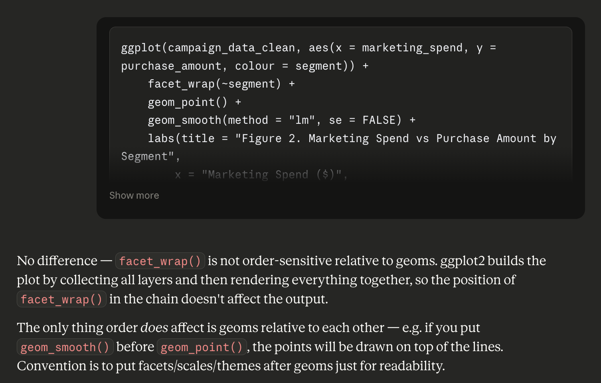

# Usage of AI

1. I used AI to clarify how I can parse the dates in different formats.

2. I used AI to figure out if I would like to use boxplots, and if they are feasible.

3. Had a question on how to best sequence facet wrap with order geom functions.

